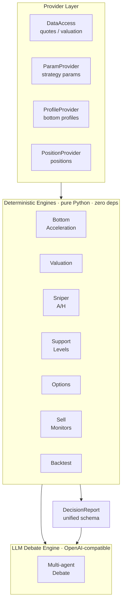
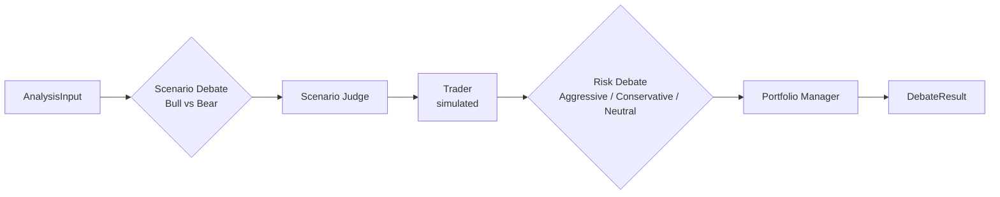

# GrinderAlpha

English | [中文](README.zh.md)

An engineering-grade investment decision system — deterministic engines for discipline, a multi-agent debate layer for judgment.

## Overview

GrinderAlpha turns the investment decision process into an engineered system. From bottom identification, valuation, and buy-point selection to stop-loss monitoring and retrospective review, each step is codified into repeatable, backtestable rules. On top of the deterministic layer sits a multi-agent LLM debate engine that synthesizes conflicting views into a structured decision. The goal is to let discipline be executed by the system, reducing the influence of human emotion — chasing rallies, hesitating to cut losses.

This is **not** high-frequency trading. The cadence is daily, weekly, monthly — low frequency, but strict. The aim is the certainty of discipline, not speed.

## Design Principles

- **Methodology as code** — each decision type (buy point, valuation, support level, stop-loss) is distilled into rules that can be stated, repeated, and backtested.
- **Providers, not hard dependencies** — data access, strategy params, bottom profiles, and positions are each abstracted behind a Provider interface, with a public (self-contained) and a private (production) implementation.
- **Discipline by machine** — discipline is counter to human nature, so it is handed to code.

## Architecture

Two layers, a clear division of labor:

- **Deterministic engines** (`investment/` + top-level engines) — rules and backtests. Bottom acceleration, valuation, support levels, Black-Scholes. Pure math, zero third-party dependencies.
- **LLM debate engine** (`investment/debate_engine/`) — a multi-agent debate that turns raw data into a structured decision.



The debate engine orchestrates several LLM agents in a pipeline:



Design highlights:

- **Adversarial debate** — bull and bear agents argue against each other, rather than a single LLM producing one opinion.
- **Tiered models** — judge/PM nodes use a stronger model; debaters use a faster one.
- **Context compression** — a compressor caps context across debate rounds.
- **Shadow mode** — the debate runs alongside the baseline first; it only replaces the baseline after proving itself.

The LLM produces a *recommendation*, not an order. Nothing here places trades automatically.

## Disclaimer

This project is for **educational and research purposes only**.

- Not intended as real trading or investment advice
- No guarantees of any kind
- The author assumes no liability for financial losses
- Past performance does not indicate future results

## Quick Start

```bash
git clone https://github.com/edge2012/GrinderAlpha.git
cd GrinderAlpha

# 1. Black-Scholes option pricing (pure Python, zero dependencies)
python3 -c "from investment.options_estimator import bs_put_price; print(bs_put_price(94, 82, 30/365, 0.04, 0.60))"

# 2. Backtests (install dependencies first)
pip install -r requirements.txt
python -m backtest.run --list                          # list all backtests
python -m backtest.run entry_signal --symbol sh000300  # run one on CSI 300
```

The deterministic engines depend only on the Python standard library. Backtests need `numpy`/`pandas`/`scipy`; valuation data fallback needs `akshare`. See `requirements.txt`.

## Configuration

Most features need no API key — only the LLM debate engine requires one.

| Feature | Key required | Notes |
|---------|-------------|-------|
| Deterministic engines (bottom, valuation, support, options) | None | Free public data (Tencent quotes, CBOE) |
| Valuation data fallback | None | `akshare` (legulegu / Danjuan), free |
| `investment/debate_engine/` (LLM debate) | `OPENAI_API_KEY` (or any OpenAI-compatible key) | Provider-agnostic; DeepSeek is the default fallback |

### Setting keys

The debate engine uses an OpenAI-compatible client (`langchain_openai.ChatOpenAI`), so **any OpenAI-compatible endpoint** works — OpenAI, DeepSeek, or a self-hosted vLLM.

Either approach works:

**Option 1 — environment variables:**

```bash
export OPENAI_API_KEY=sk-...
export OPENAI_BASE_URL=https://api.openai.com/v1   # or your own endpoint
```

**Option 2 — a `.env` file** (auto-loaded by the debate engine):

```bash
# .env in the project root
OPENAI_API_KEY=sk-...
OPENAI_BASE_URL=https://api.openai.com/v1
```

Resolution order (first hit wins):

- **api key**: `LLM_API_KEY` > `DEEPSEEK_API_KEY` > `OPENAI_API_KEY`
- **base URL**: `config.llm_base_url` > `LLM_BASE_URL` > `DEEPSEEK_BASE_URL` > `OPENAI_BASE_URL` > `https://api.deepseek.com/v1` (default)

The `DEEPSEEK_*` keys are kept only for backward compatibility with the private system's default provider. The debate engine's config loader reads `.env` automatically (path via `DOTENV_PATH`, default `.env`) and only sets variables not already in the environment — so env vars always win. The `.env` file is gitignored, so your keys stay out of version control.

## Repository Structure

```
grinderalpha/
├── backtest/                       # Backtest runner (core / data / run)
├── bottom_accelerator.py           # Bottom acceleration: trendline + DCA multiplier
├── valuation_engine.py             # Valuation: per-category PE/PB percentile
├── investment/                     # Core package (name intentionally kept "investment")
│   ├── data_access.py              # DataAccess provider (quotes + valuation)
│   ├── param_provider.py           # ParamProvider (strategy params)
│   ├── profile_provider.py         # ProfileProvider (bottom profiles)
│   ├── support_levels.py           # Support-level extraction
│   ├── options_estimator.py        # Pure-Python Black-Scholes (fallback)
│   ├── cboe_options.py             # CBOE options chain client
│   ├── decision_report.py          # Unified decision report schema (Action + resolve_action)
│   ├── methodologies/              # Buy-point methodologies (base + sniper_ah)
│   ├── sell_monitors/              # Sell monitors (PositionProvider + 3 strategies)
│   └── debate_engine/              # LLM multi-agent debate
├── data/bottom_profiles/           # Sample bottom profiles
├── examples/                       # Teaching examples
└── strategy_params.example.json    # Placeholder params (zero-filled)
```

## Core Modules

### Bottom acceleration (`bottom_accelerator.py`)

Fits a log-linear trendline through confirmed historical bottoms, projects it to today, and classifies how far the current price sits below the trendline. The "hitting zone" is when price touches or breaks below the projected bottom — the deeper the discount, the larger the DCA (dollar-cost-averaging) multiplier. Each index is calibrated independently.

### Valuation (`valuation_engine.py`)

Per-category valuation — broad index, dividend, sector, AI-chain, and HK shares each use a different method. Multi-source with graceful degradation: the official China Securities Index site is the primary PE source, falling back to `akshare` (legulegu) and Danjuan snapshots when unavailable.

### A/H sniper methodology (`investment/methodologies/sniper_ah.py`)

"Good company + extreme cheapness → fire." Two independent anchors — PE returns to its historical bottom range, and drawdown touches historical extremes. Both satisfied means in range. Reads bottom profiles and Tencent real-time quotes.

### Support levels (`investment/support_levels.py`)

Extracts support from real historical drawdown bottoms rather than arbitrary multipliers. Support is protection, not a strike-price anchor: S1 is the highest bottom below current price, S2 the next-deeper one.

### Options (`investment/cboe_options.py` + `options_estimator.py`)

`cboe_options.py` fetches real CBOE delayed bid/ask mid-prices and enforces a liquidity gate (`bid=0` blocks). `options_estimator.py` is a pure-Python Black-Scholes fallback (no scipy), used only when the live chain is unavailable — estimation was demoted to a documented fallback after a live test proved it wrong by 55 percentage points.

### Decision report (`investment/decision_report.py`)

A zero-dependency schema that unifies every engine's output into one structured report: `DecisionReport` carries the recommended `Action` (BUY / ADD / HOLD / TRIM / EXIT / WAIT / REBUY), per-dimension checks, a derivation `trace`, and data-source info. `resolve_action` enforces a priority ladder — stop-loss beats everything, take-profit beats adding, adding beats new positions.

### Sell monitors (`investment/sell_monitors/`)

Three strategies — mean reversion, trend following, and index DCA — each reading positions through the `PositionProvider` interface. The public implementation (`DictPositionProvider`) accepts a plain dict; the production one (`DBPositionProvider`) is a lazy import and never triggers in the public repo.

### Backtest (`backtest/`)

A unified entry point — `python -m backtest.run <name>`. Each backtest is registered under a name and routed to pure-computation cores, outputting long-term return / win rate / max drawdown plus a data-source declaration.

## Known Limitations

| Limitation | Status |
|-----------|--------|
| Only A/H methodology shipped; US methodologies (trend/value/growth/turnaround) are Phase 2 | Enum placeholders present, implementations deferred |
| Macro regime layer (multi-indicator posture classification) is Phase 2 | Not shipped in this snapshot |
| Debate engine output quality depends on the underlying LLM | Shadow mode validates before promotion |
| Options backtests are recent | CBOE path added 2026-08 |
| Temperature weights are experience-set | Back-infer from posture data (planned) |

## License

[MIT](LICENSE)
