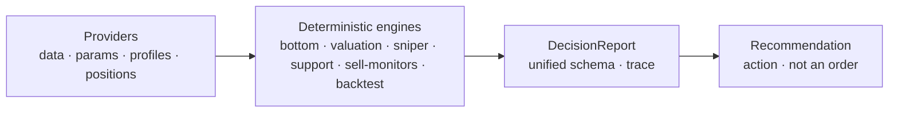
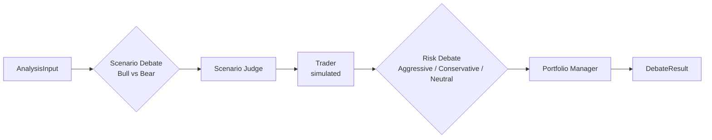

# GrinderAlpha

English | [中文](README.zh.md)

An engineering-grade investment decision system — discipline as code, every decision traceable and backtestable.

## Why GrinderAlpha

Discipline is a long-term investor's only edge — and the thing humans are worst at. You know to buy when the market panics and trim when it's euphoric; but when your money is on the line, emotion wins. Most "AI trading" tools make this worse: a black-box signal you're asked to trust. GrinderAlpha does the opposite — it codifies discipline into deterministic rules (when to buy, add, trim, exit, rebuy), and every decision shows its work: which data went in, which rule fired, what came out. You don't trust it; you audit it.

**Scope** — this release targets **A-share / HK (China equities)**: ETF dollar-cost-averaging as the main line, A/H stock sniping as the advanced path. US methodologies are on the roadmap (see [Known Limitations](#known-limitations)).

This is **not** high-frequency trading. The cadence is daily, weekly, monthly — low frequency, but strict. The goal is the certainty of discipline, not speed.

## What a decision looks like

Don't take our word for it. One command — no key, no dependencies — and you get a complete, human-readable decision report:

```bash
python3 examples/demo_decision_report.py
```

```text
📋 决策报告 | 510300 ETF定投
════════════════════════════════════════════════════════

结论  沪深300 距历史底部趋势线 -18% → 落入「恐慌区」，DCA 倍率 3x，估值确认 upgraded
      动作 ADD · 信心 8/10 · 区间 ¥4.0-4.3（恐慌区）

证据
  ✓ 大底趋势     现价折算指数 4166，趋势线投影 5080，偏离 -18%  [腾讯行情(实时)]
  ✓ 估值       指数 PE 分位 28% → 不贵  [akshare]
  ✓ 止损       距 50MA -3% → 建仓期仅展示不拦截  [腾讯日K]

推导
  ① 拉取历史大底
    输入 BOTTOM_DEFINITIONS["沪深300"]
    规则 读历史大底常量
    结果 [807(2005-06), 2836(2014-06)...]
  ② 拟合趋势线
    输入 上一步的底点
    规则 对数线性拟合
    结果 年化 +8.1%, r²=0.98
  ③ 投影当前
    输入 slope + intercept
    规则 趋势线外推
    结果 投影 5080 点
  ④ 拉取实时价
    输入 腾讯 qt.gtimg.cn
    规则 实时行情
    结果 ¥4.20（折算指数 4166）
  ⑤ 判定区域
    输入 4166 vs 5080
    规则 (4166-5080)/5080 = -18%
    结果 落入恐慌区 → DCA 3x

数据  历史大底常量(static,2005-06 起) · 腾讯行情(realtime,now) · akshare 估值(realtime,now)

回测  python -m backtest.run entry_signal --symbol sh000300
数据截至 2026-08-31 · schema v1.0
```

Three layers in one report: a **conclusion** (what to do now), **evidence** (each dimension with its rule and data source), and a **derivation trace** (every step: input → rule → output). The trace is the whole point — it turns a recommendation into something you can audit.

> **ETF vs index** — `510300` is the tradable ETF tracking the CSI 300 index (`sh000300`). The bottom trendline is judged on the *index* (in points), while buying and selling execute on the *ETF* (in yuan). A per-ETF calibration factor (`510300 → ×992`) converts between the two, which is why the report shows both "¥4.20" and "折算指数 4166". The backtest command above runs on `sh000300` (the index) because historical K-line data lives at index level.

## Quick Start

The main line — a decision report and a backtest — needs no API key:

```bash
git clone https://github.com/edge2012/GrinderAlpha.git
cd GrinderAlpha

# 1. See a full decision report (zero deps, no key)
python3 examples/demo_decision_report.py                    # CSI 300
python3 examples/demo_decision_report.py --symbol 510050    # your own ETF

# 2. Backtests (install dependencies first)
pip install -r requirements.txt
python -m backtest.run --list                          # list all backtests
python -m backtest.run entry_signal --symbol sh000300  # run one on CSI 300
```

The deterministic engines depend only on the Python standard library. Backtests need `numpy`/`pandas`/`scipy`; valuation data fallback needs `akshare`. See `requirements.txt`.

## Design Principles

- **Methodology as code** — every decision type (buy point, valuation, support, stop-loss) is distilled into rules that can be stated, repeated, and backtested.
- **Providers, not hard dependencies** — data access, strategy params, bottom profiles, and positions are abstracted behind interfaces, so the engines stay decoupled from where that data comes from.
- **Discipline by machine** — discipline is counter to human nature, so it is handed to code.
- **Long-term, not prediction** — the system sells discipline and data, not "will it go up tomorrow". Good asset + good price + long holding.

## Architecture

The deterministic main pipeline — rules and backtests, pure math, zero dependencies, no key:



On top sits a small **toolbox** of optional, on-demand tools — they share the same data but are not part of the main pipeline:

| Tool | What it does | Needs key |
|------|--------------|-----------|
| LLM debate engine | multi-agent, qualitative analysis | yes |
| Option pricing (Black-Scholes) | standalone pricing calculator | no |

The debate engine orchestrates several LLM agents:



Design highlights:

- **Adversarial debate** — bull and bear agents argue against each other, rather than a single LLM producing one opinion.
- **Tiered models** — judge/PM nodes use a stronger model; debaters use a faster one.
- **Context compression** — a compressor caps context across debate rounds.
- **Shadow mode** — the debate first runs read-only alongside the deterministic output, and only affects the final recommendation after proving itself.

The LLM produces a *recommendation*, not an order. Nothing here places trades automatically.

## Lifecycle

A position flows through a full life cycle, expressed with one action vocabulary:

| Action | Meaning | Engine |
|--------|---------|--------|
| `BUY` | open a position | `bottom_accelerator` / `sniper_ah` |
| `ADD` | DCA add (buy more as it drops) | `bottom_accelerator` |
| `HOLD` | hold | — |
| `TRIM` | take profit / reduce | `sell_monitors` |
| `EXIT` | stop-loss / close | `sell_monitors` |
| `REBUY` | rebuy after trim | `sell_monitors` |
| `WAIT` | no position, conditions unmet | — |

When multiple signals conflict, one priority ladder resolves them — stop-loss beats everything, take-profit beats adding, adding beats new positions:

```
EXIT > TRIM > ADD > BUY > REBUY > HOLD / WAIT
```

## Core Modules

The deterministic layer is organized around the decision lifecycle. Every module is pure Python and runs on free public data unless noted; only the debate engine needs a key.

| Stage | Module | What it does |
|-------|--------|--------------|
| **Buy** | `bottom_accelerator.py` | Fits a log-linear trendline through historical bottoms and sizes the DCA multiplier by how far below it the price sits (per-index calibration) |
| **Buy** | `investment/methodologies/sniper_ah.py` | "Good company + extreme cheapness": PE back to its historical bottom **and** drawdown at extremes |
| **Value** | `valuation_engine.py` | Per-category PE/PB percentile (broad / dividend / sector / AI-chain / HK), multi-source with graceful degradation |
| **Protect** | `investment/support_levels.py` | S1/S2 support derived from real drawdown bottoms — protection, not a strike anchor |
| **Protect** | `investment/sell_monitors/` | Sell / stop / rebuy through the `PositionProvider` interface (3 strategies) |
| **Decide** | `investment/decision_report.py` | Unified `DecisionReport` schema: action + per-dimension checks + derivation `trace` |
| **Enhance** | `investment/cboe_options.py` + `options_estimator.py` | Real CBOE chain (liquidity-gated) with a pure-Python Black-Scholes fallback |
| **Verify** | `backtest/` | Unified runner → long-term return / win-rate / max drawdown, with a data-source declaration |
| **Debate** | `investment/debate_engine/` | Multi-agent LLM debate — an optional side tool (the only key-requiring module) |

Three details worth calling out, because this is where the engineering — not the "AI" — does the work:

- **Support is protection.** `support_levels.py` derives S1/S2 from real historical drawdown bottoms, not arbitrary multipliers.
- **Estimation is a fallback, not a promise.** `options_estimator.py` (pure-Python Black-Scholes) was demoted to a documented fallback after a live test showed it off by 55 percentage points against the real CBOE chain.
- **Stop-loss beats everything.** `decision_report.resolve_action` enforces a priority ladder — stop-loss > take-profit > adding > new positions.

## Configuration

Everything runs on free public data with no key — only the LLM debate engine needs one.

| Feature | Key required | Notes |
|---------|-------------|-------|
| Deterministic engines (bottom, valuation, support, options) | None | Free public data (Tencent quotes, CBOE) |
| Valuation data fallback | None | `akshare` (legulegu / Danjuan), free |
| `investment/debate_engine/` (LLM debate) | `OPENAI_API_KEY` + `OPENAI_BASE_URL` | Any OpenAI-compatible endpoint |

### LLM provider (debate engine only)

The debate engine uses an OpenAI-compatible client (`langchain_openai.ChatOpenAI`), so it works with any endpoint that speaks the OpenAI `/v1` protocol — OpenAI, DeepSeek, Qwen, GLM, or a self-hosted vLLM / LM Studio. Set both variables:

```bash
export OPENAI_API_KEY=sk-...
export OPENAI_BASE_URL=https://api.openai.com/v1
```

Common endpoints:

| Provider | `OPENAI_BASE_URL` |
|----------|-------------------|
| OpenAI | `https://api.openai.com/v1` |
| DeepSeek | `https://api.deepseek.com/v1` |
| Self-hosted vLLM / LM Studio | `http://localhost:8000/v1` |

The same pattern extends to any OpenAI-compatible provider — just point `OPENAI_BASE_URL` at its `/v1` endpoint.

> **Backward compatibility.** `DEEPSEEK_API_KEY` / `DEEPSEEK_BASE_URL` (and `LLM_API_KEY` / `LLM_BASE_URL`) are still recognized, kept only so existing setups that predate the `OPENAI_*` convention keep working. New users can ignore them and just set `OPENAI_API_KEY` + `OPENAI_BASE_URL`.

## Additional tools

Two demo scripts, each one command:

```bash
python3 examples/demo_options.py                            # option pricing — zero deps, no key
python3 examples/demo_options.py --S 100 --K 90 --sigma 0.5 # your own parameters
python3 examples/demo_debate.py                             # LLM debate — needs an API key (see Configuration)
python3 examples/demo_debate.py --ticker 00700              # your own ticker
```

- `demo_options.py` prices a put via `--S/--K/--T-days/--r/--sigma` (run `--help` for the full list).
- `demo_debate.py` runs a multi-agent debate via `--ticker/--company/--date`; without a key it prints the setup steps. The four analyst reports are sample text — build your own `AnalysisInput` for real analysis.

> The Black-Scholes calculator is a standalone pricing formula, independent of the US options-enhancement strategies on the Phase-2 roadmap.

## Repository Structure

```
grinderalpha/
├── backtest/                       # Backtest runner (core / data / run)
├── bottom_accelerator.py           # Bottom acceleration: trendline + DCA multiplier
├── valuation_engine.py             # Valuation: per-category PE/PB percentile
├── investment/                     # Core package (engines + providers + debate)
│   ├── data_access.py              # DataAccess provider (quotes + valuation)
│   ├── param_provider.py           # ParamProvider (strategy params)
│   ├── profile_provider.py         # ProfileProvider (bottom profiles)
│   ├── support_levels.py           # Support-level extraction
│   ├── options_estimator.py        # Pure-Python Black-Scholes (fallback)
│   ├── cboe_options.py             # CBOE options chain client
│   ├── decision_report.py          # Unified decision report schema (Action + resolve_action)
│   ├── methodologies/              # Buy-point methodologies (base + sniper_ah)
│   ├── sell_monitors/              # Sell monitors (PositionProvider + 3 strategies)
│   └── debate_engine/              # LLM multi-agent debate (optional side tool)
├── data/bottom_profiles/           # Sample bottom profiles
├── examples/                       # Runnable demos (decision report, …)
└── strategy_params.example.json    # Example strategy params (copy and tune)
```

## Known Limitations

| Area | Status |
|-------|--------|
| US methodologies (trend / value / growth / turnaround) | Planned |
| Macro regime layer (multi-indicator posture classification) | Planned |
| Temperature weights | Experience-set; back-inferred from posture data (planned) |
| Debate engine output quality | Depends on the underlying LLM; shadow mode validates before promotion |
| Options backtests | Recent — CBOE path added 2026-08 |

## Disclaimer

This project is for **educational and research purposes only**.

- Not intended as real trading or investment advice
- No guarantees of any kind
- The author assumes no liability for financial losses
- Past performance does not indicate future results

## License

[MIT](LICENSE)
