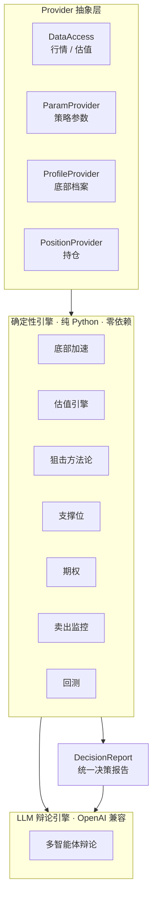
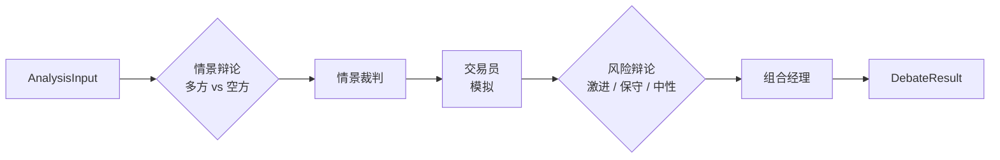

# GrinderAlpha

[English](README.md) | 中文

一个工程化的投资决策系统 —— 确定性引擎负责纪律，多智能体辩论层负责判断。

## 概述

GrinderAlpha 把投资决策过程工程化为一个系统。从底部识别、估值、买点选择，到止损监控与复盘，每一步都被编码为可重复、可回测的规则。在确定性层之上，是一个多智能体 LLM 辩论引擎，把相互冲突的观点综合成结构化决策。目标是让纪律由系统来执行，减少人性的干扰 —— 追涨、舍不得割肉。

这**不是**高频交易。节奏是日、周、月 —— 低频，但严格。追求的是纪律的确定性，而非速度。

## 设计原则

- **方法论即代码** —— 每一种决策类型（买点、估值、支撑位、止损）都被提炼为可陈述、可重复、可回测的规则。
- **Provider 而非硬依赖** —— 数据访问、策略参数、底部档案、持仓，各自抽象在 Provider 接口之后，分别有公开（自包含）与私有（生产）两种实现。
- **机器执行纪律** —— 纪律违逆人性，所以交给代码。

## 架构

两层，分工明确：

- **确定性引擎**（`investment/` + 顶层引擎）—— 规则与回测。底部加速、估值、支撑位、Black-Scholes。纯数学，零第三方依赖。
- **LLM 辩论引擎**（`investment/debate_engine/`）—— 多智能体辩论，把原始数据转化为结构化决策。



辩论引擎按流水线编排多个 LLM 智能体：



设计亮点：

- **对抗式辩论** —— 多方与空方智能体彼此交锋，而非单个 LLM 给出一个观点。
- **分层模型** —— 裁判/组合经理节点用更强的模型；辩论方用更快的模型。
- **上下文压缩** —— 压缩器在多轮辩论中封顶上下文。
- **影子模式** —— 辩论先与基线并行运行，证明自己后才替换基线。

LLM 产出的是*建议*，不是订单。这里没有任何东西会自动下单。

## 免责声明

本项目仅用于**教育与研究目的**。

- 不构成真实交易或投资建议
- 不作任何形式的保证
- 作者不对财务损失承担任何责任
- 过往表现不代表未来结果

## 快速开始

```bash
git clone https://github.com/edge2012/GrinderAlpha.git
cd GrinderAlpha

# 1. Black-Scholes 期权定价（纯 Python，零依赖）
python3 -c "from investment.options_estimator import bs_put_price; print(bs_put_price(94, 82, 30/365, 0.04, 0.60))"

# 2. 回测（先装依赖）
pip install -r requirements.txt
python -m backtest.run --list                          # 列出所有回测
python -m backtest.run entry_signal --symbol sh000300  # 对沪深300跑一个
```

确定性引擎只依赖 Python 标准库。回测需要 `numpy`/`pandas`/`scipy`；估值数据兜底需要 `akshare`。见 `requirements.txt`。

## 配置

大多数功能不需要 API key —— 只有 LLM 辩论引擎需要。

| 功能 | 需要的 Key | 说明 |
|------|-----------|------|
| 确定性引擎（底部、估值、支撑、期权） | 无 | 免费公开数据（腾讯行情、CBOE） |
| 估值数据兜底 | 无 | `akshare`（legulegu / 蛋卷），免费 |
| `investment/debate_engine/`（LLM 辩论） | `OPENAI_API_KEY`（或任意 OpenAI 兼容 key） | Provider 无关；DeepSeek 为默认回退 |

### 设置 Key

辩论引擎使用 OpenAI 兼容客户端（`langchain_openai.ChatOpenAI`），因此**任意 OpenAI 兼容端点**均可 —— OpenAI、DeepSeek、或自托管 vLLM。

两种方式任选其一：

**方式一 —— 环境变量：**

```bash
export OPENAI_API_KEY=sk-...
export OPENAI_BASE_URL=https://api.openai.com/v1   # 或你自己的端点
```

**方式二 —— `.env` 文件**（辩论引擎自动加载）：

```bash
# 项目根目录的 .env
OPENAI_API_KEY=sk-...
OPENAI_BASE_URL=https://api.openai.com/v1
```

解析优先级（先命中者胜）：

- **api key**：`LLM_API_KEY` > `DEEPSEEK_API_KEY` > `OPENAI_API_KEY`
- **base URL**：`config.llm_base_url` > `LLM_BASE_URL` > `DEEPSEEK_BASE_URL` > `OPENAI_BASE_URL` > `https://api.deepseek.com/v1`（默认）

`DEEPSEEK_*` 仅用于与私有系统默认 provider 的向后兼容。辩论引擎的配置加载器会自动读取 `.env`（路径经 `DOTENV_PATH`，默认 `.env`），且只设置环境里没有的变量 —— 所以环境变量始终优先。`.env` 文件已 gitignore，密钥不会进入版本控制。

## 仓库结构

```
grinderalpha/
├── backtest/                       # 回测入口（core / data / run）
├── bottom_accelerator.py           # 底部加速：趋势线 + DCA 倍率
├── valuation_engine.py             # 估值：分类型 PE/PB 百分位
├── investment/                     # 核心包（包名有意保留 "investment"）
│   ├── data_access.py              # DataAccess provider（行情 + 估值）
│   ├── param_provider.py           # ParamProvider（策略参数）
│   ├── profile_provider.py         # ProfileProvider（底部档案）
│   ├── support_levels.py           # 支撑位提取
│   ├── options_estimator.py        # 纯 Python Black-Scholes（兜底）
│   ├── cboe_options.py             # CBOE 期权链客户端
│   ├── decision_report.py          # 统一决策报告 schema（Action + resolve_action）
│   ├── methodologies/              # 买点方法论（base + sniper_ah）
│   ├── sell_monitors/              # 卖出监控（PositionProvider + 3 策略）
│   └── debate_engine/              # LLM 多智能体辩论
├── data/bottom_profiles/           # 示例底部档案
├── examples/                       # 教学示例
└── strategy_params.example.json    # 占位参数（全 0）
```

## 核心模块

### 底部加速（`bottom_accelerator.py`）

对已确认的历史大底拟合对数线性趋势线，投影到当下，判定当前价格偏离趋势线的程度。当价格触及或跌破投影底部即为「击球区」——折扣越深，DCA（定投）倍率越大。各指数独立校准。

### 估值（`valuation_engine.py`）

分类型估值 —— 宽基、红利、行业、AI 链、港股各用不同方法。多源优雅降级：中证指数官网为主 PE 源，不可用时回退 `akshare`（legulegu）与蛋卷快照。

### A/H 狙击方法论（`investment/methodologies/sniper_ah.py`）

「好公司 + 极端便宜 → 开枪」。两个独立锚 —— PE 回到历史底部区间、回撤触及历史极值。双条件满足即在射程。读取底部档案与腾讯实时价格。

### 支撑位（`investment/support_levels.py`）

从真实历史回撤底部提取支撑，而非任意乘数。支撑是保护，不是行权价的锚：S1 是现价下方最近的历史回撤底部，S2 是次深的一道防线。

### 期权（`investment/cboe_options.py` + `options_estimator.py`）

`cboe_options.py` 拉取 CBOE 延迟 bid/ask 中间价，并强制流动性门槛（`bid=0` 阻断）。`options_estimator.py` 是纯 Python Black-Scholes 兜底（无 scipy），仅在实时链不可用时启用 —— 一次实盘测试证明估算偏差高达 55 个百分点后，估算被降级为文档化的兜底路径。

### 决策报告（`investment/decision_report.py`）

零依赖 schema，把每个引擎的输出统一为一份结构化报告：`DecisionReport` 携带推荐的 `Action`（BUY / ADD / HOLD / TRIM / EXIT / WAIT / REBUY）、逐维度检查、推导链 `trace` 与数据源信息。`resolve_action` 执行优先级阶梯 —— 止损压一切、止盈压加仓、加仓压建仓。

### 卖出监控（`investment/sell_monitors/`）

三个策略 —— 均值回归、趋势跟踪、指数定投 —— 各自通过 `PositionProvider` 接口读持仓。公开实现（`DictPositionProvider`）接受普通 dict；生产实现（`DBPositionProvider`）是延迟导入，公开库不会触发。

### 回测（`backtest/`）

统一入口 —— `python -m backtest.run <name>`。每个回测注册一个名字，路由到纯计算核心，输出长期收益 / 胜率 / 最大回撤外加数据来源声明。

## 已知限制

| 限制 | 状态 |
|------|------|
| 仅发布 A/H 方法论；美股方法论（trend/value/growth/turnaround）为 Phase 2 | 枚举占位已存在，实现延后 |
| 宏观 regime 层（多指标姿态分类）为 Phase 2 | 本快照未发布 |
| 辩论引擎输出质量取决于底层 LLM | 影子模式验证后才替换 |
| 期权回测较新 | CBOE 路径 2026-08 加入 |
| 温度权重为经验设定 | 计划从姿态数据反推 |

## License

[MIT](LICENSE)
