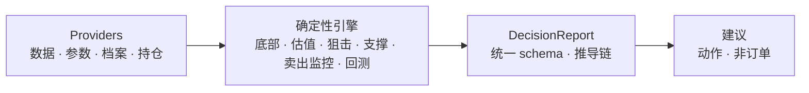
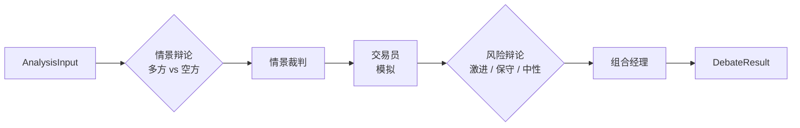

# GrinderAlpha

[English](README.md) | 中文

一个工程化的投资决策系统 —— 确定性引擎负责纪律，多智能体辩论层负责判断。每一个决策都可追溯：读得懂、可回测 —— 没有黑箱。

## 为什么是 GrinderAlpha

纪律是长期投资者唯一的优势 —— 也恰恰是人最不擅长的东西。你知道市场恐慌时该买、亢奋时该减；可真金白银压在里头时，情绪会赢。多数「AI 炒股」工具反而雪上加霜：丢给你一个黑箱信号，要求你「信它就完了」。GrinderAlpha 反着来 —— 把纪律变成确定性规则（何时买、加、减、清、回补），每个决策都摊开过程：什么数据进去、哪条规则触发、得出什么。你不是「信它」，而是「审计它」。

**范围** —— 本版专注 **A股 / 港股（中国股票）**：ETF 定投为主线，A/H 个股狙击为进阶路径。美股方法论在路线图上（见[已知限制](#已知限制)）。

这**不是**高频交易。节奏是日、周、月 —— 低频，但严格。追求的是纪律的确定性，而非速度。

## 一份决策报告长这样

别只听我们说，自己跑一条命令 —— 无需 key、无需依赖 —— 得到一份完整、人类可读的决策报告：

```bash
python3 examples/demo_decision_report.py
```

```text
📋 决策报告 | 510300 ETF定投
════════════════════════════════════════════════════════

结论  沪深300 距历史底部趋势线 -18% → 落入「恐慌区」，DCA 倍率 3x，估值确认 upgraded
      动作 ADD · 信心 8/10 · 区间 ¥4.0-4.3（恐慌区）

证据
  ✓ 大底趋势     现价折算指数 4166，趋势线投影 5080，偏离 -18%  [腾讯行情(实时)]
  ✓ 估值       指数 PE 分位 28% → 不贵  [akshare]
  ✓ 仓位纪律     单标的占比 12% < 15% 纪律线  [用户持仓]
  ✓ 止损       距 50MA -3% → 建仓期仅展示不拦截  [腾讯日K]

推导
  ① 拉取历史大底
    输入 BOTTOM_DEFINITIONS["沪深300"]
    规则 读历史大底常量
    结果 [807(2005-06), 2836(2014-06)...]
  ② 拟合趋势线
    输入 上一步的底点
    规则 对数线性拟合
    结果 年化 +8.1%, r²=0.98
  ③ 投影当前
    输入 slope + intercept
    规则 趋势线外推
    结果 投影 5080 点
  ④ 拉取实时价
    输入 腾讯 qt.gtimg.cn
    规则 实时行情
    结果 ¥4.20（折算指数 4166）
  ⑤ 判定区域
    输入 4166 vs 5080
    规则 (4166-5080)/5080 = -18%
    结果 落入恐慌区 → DCA 3x

数据  历史大底常量(static,2005-06 起) · 腾讯行情(realtime,now) · akshare 估值(realtime,now)

回测  python -m backtest.run entry_signal --symbol sh000300
数据截至 2026-08-31 · schema v1.0
```

一份报告三层：**结论**（现在该做什么）、**证据**（每个维度带规则与数据源）、**推导链**（每一步：输入 → 规则 → 输出）。推导链是全部重点 —— 它把「建议」变成「你能审计的东西」。

> **ETF 与指数的关系** —— `510300` 是跟踪沪深300 指数（`sh000300`）的可交易 ETF。底部趋势线按**指数**（点位）判断，买卖执行按**ETF**（元）进行，靠每只 ETF 的换算系数（`510300 → ×992`）在两者间换算——所以报告里同时出现「¥4.20」和「折算指数 4166」。上面那条回测命令跑的是 `sh000300`（指数），因为历史 K 线数据在指数级别。

## 设计原则

- **方法论即代码** —— 每一种决策类型（买点、估值、支撑、止损）都被提炼为可陈述、可重复、可回测的规则。
- **Provider 而非硬依赖** —— 数据访问、策略参数、底部档案、持仓各自抽象在接口之后，让引擎与数据的来源解耦。
- **机器执行纪律** —— 纪律违逆人性，所以交给代码。
- **长期主义，不做预测** —— 系统卖的是纪律与数据，不是「明天涨不涨」。好资产 + 好价格 + 长期持有。

## 架构

两层，各司其职：

- **确定性引擎**（`investment/` + 顶层引擎）—— 主流程。规则与回测：底部加速、估值、支撑位、Black-Scholes。纯数学，零依赖，无需 API key。
- **LLM 辩论引擎**（`investment/debate_engine/`）—— 一个*可选*的旁路工具，做定性、多角度的分析。需要 API key，按需主动调用；它**不是**确定性主流程的一部分。

主流程（确定性，无需 key）：



当你选择运行辩论引擎时，它编排多个 LLM 智能体：



设计亮点：

- **对抗式辩论** —— 多方与空方智能体彼此交锋，而非单个 LLM 给出一个观点。
- **分层模型** —— 裁判/组合经理节点用更强的模型；辩论方用更快的模型。
- **上下文压缩** —— 压缩器在多轮辩论中封顶上下文。
- **影子模式** —— 辩论先以只读方式与确定性输出并行运行，证明自己后才影响最终建议。

LLM 产出的是*建议*，不是订单。这里没有任何东西会自动下单。

## 生命周期

一个持仓走完整生命周期，用同一套动作词汇表达：

| 动作 | 含义 | 引擎 |
|------|------|------|
| `BUY` | 首次建仓 | `bottom_accelerator` / `sniper_ah` |
| `ADD` | 定投加仓（越跌越买） | `bottom_accelerator` |
| `HOLD` | 持有 | — |
| `TRIM` | 止盈 / 减仓 | `sell_monitors` |
| `EXIT` | 止损 / 清仓 | `sell_monitors` |
| `REBUY` | 减仓后回补 | `sell_monitors` |
| `WAIT` | 无持仓、条件未满足 | — |

多个信号冲突时，一条优先级阶梯来裁决 —— 止损压一切、止盈压加仓、加仓压建仓：

```
EXIT > TRIM > ADD > BUY > REBUY > HOLD / WAIT
```

## 免责声明

本项目仅用于**教育与研究目的**。

- 不构成真实交易或投资建议
- 不作任何形式的保证
- 作者不对财务损失承担任何责任
- 过往表现不代表未来结果

## 快速开始

主线 —— 一份决策报告 + 一次回测 —— 无需 API key：

```bash
git clone https://github.com/edge2012/GrinderAlpha.git
cd GrinderAlpha

# 1. 看一份完整决策报告（零依赖、无需 key）
python3 examples/demo_decision_report.py

# 2. 回测（先装依赖）
pip install -r requirements.txt
python -m backtest.run --list                          # 列出所有回测
python -m backtest.run entry_signal --symbol sh000300  # 对沪深300跑一个
```

确定性引擎只依赖 Python 标准库。回测需要 `numpy`/`pandas`/`scipy`；估值数据兜底需要 `akshare`。见 `requirements.txt`。

## 额外工具

主线 ETF 定投闭环之外，还有两个独立工具，想进一步探索时可以试：

**期权定价（Black-Scholes）** —— 纯 Python、零依赖的计算器：

```bash
python3 -c "from investment.options_estimator import bs_put_price; print(bs_put_price(94, 82, 30/365, 0.04, 0.60))"
```

**LLM 辩论引擎** —— 多智能体定性分析。需要 API key（见[配置](#配置)），按需主动调用：

```python
from investment.debate_engine import DebateEngine, AnalysisInput, run_debate
```

> Black-Scholes 计算器是独立的定价公式，与 Phase-2 路线图上的美股期权增强策略无关。

## 配置

所有功能都跑在免费公开数据上，无需 key —— 只有 LLM 辩论引擎需要一个。

| 功能 | 需要的 Key | 说明 |
|------|-----------|------|
| 确定性引擎（底部、估值、支撑、期权） | 无 | 免费公开数据（腾讯行情、CBOE） |
| 估值数据兜底 | 无 | `akshare`（legulegu / 蛋卷），免费 |
| `investment/debate_engine/`（LLM 辩论） | `OPENAI_API_KEY` + `OPENAI_BASE_URL` | 任意 OpenAI 兼容端点 |

### LLM 后端（仅辩论引擎）

辩论引擎使用 OpenAI 兼容客户端（`langchain_openai.ChatOpenAI`），因此任何讲 OpenAI `/v1` 协议的端点都能用 —— OpenAI、DeepSeek、Qwen、GLM，或自托管 vLLM / LM Studio。设置两个变量：

```bash
export OPENAI_API_KEY=sk-...
export OPENAI_BASE_URL=https://api.openai.com/v1
```

常见端点：

| Provider | `OPENAI_BASE_URL` |
|----------|-------------------|
| OpenAI | `https://api.openai.com/v1` |
| DeepSeek | `https://api.deepseek.com/v1` |
| 自托管 vLLM / LM Studio | `http://localhost:8000/v1` |

同样的方式适用于任何 OpenAI 兼容 provider —— 把 `OPENAI_BASE_URL` 指向它的 `/v1` 端点即可。

> **向后兼容。** `DEEPSEEK_API_KEY` / `DEEPSEEK_BASE_URL`（以及 `LLM_API_KEY` / `LLM_BASE_URL`）仍会被识别，保留只是为了兼容 `OPENAI_*` 约定之前的旧配置。新用户忽略它们，设置 `OPENAI_API_KEY` + `OPENAI_BASE_URL` 即可。

## 仓库结构

```
grinderalpha/
├── backtest/                       # 回测入口（core / data / run）
├── bottom_accelerator.py           # 底部加速：趋势线 + DCA 倍率
├── valuation_engine.py             # 估值：分类型 PE/PB 百分位
├── investment/                     # 核心包（引擎 + provider + 辩论）
│   ├── data_access.py              # DataAccess provider（行情 + 估值）
│   ├── param_provider.py           # ParamProvider（策略参数）
│   ├── profile_provider.py         # ProfileProvider（底部档案）
│   ├── support_levels.py           # 支撑位提取
│   ├── options_estimator.py        # 纯 Python Black-Scholes（兜底）
│   ├── cboe_options.py             # CBOE 期权链客户端
│   ├── decision_report.py          # 统一决策报告 schema（Action + resolve_action）
│   ├── methodologies/              # 买点方法论（base + sniper_ah）
│   ├── sell_monitors/              # 卖出监控（PositionProvider + 3 策略）
│   └── debate_engine/              # LLM 多智能体辩论（可选旁路工具）
├── data/bottom_profiles/           # 示例底部档案
├── examples/                       # 可运行示例（决策报告等）
└── strategy_params.example.json    # 策略参数示例（复制后按需调整）
```

## 核心模块

确定性层围绕决策生命周期组织。每个模块都是纯 Python、跑在免费公开数据上（除非特别标注）；只有辩论引擎需要 key。

| 阶段 | 模块 | 作用 |
|------|------|------|
| **买入** | `bottom_accelerator.py` | 对历史大底拟合对数线性趋势线，按价格低于趋势线的深度确定 DCA 倍率（各指数独立校准） |
| **买入** | `investment/methodologies/sniper_ah.py` | 「好公司 + 极端便宜」：PE 回到历史底部区间，且回撤触及极值 |
| **估值** | `valuation_engine.py` | 分类型 PE/PB 百分位（宽基 / 红利 / 行业 / AI 链 / 港股），多源优雅降级 |
| **保护** | `investment/support_levels.py` | 从真实历史回撤底部提取 S1/S2 —— 支撑是保护，不是行权价的锚 |
| **保护** | `investment/sell_monitors/` | 通过 `PositionProvider` 接口执行卖出 / 止损 / 回补（3 个策略） |
| **决策** | `investment/decision_report.py` | 统一 `DecisionReport` schema：动作 + 逐维度检查 + 推导链 `trace` |
| **增强** | `investment/cboe_options.py` + `options_estimator.py` | 真实 CBOE 期权链（流动性门槛）+ 纯 Python Black-Scholes 兜底 |
| **验证** | `backtest/` | 统一入口 → 长期收益 / 胜率 / 最大回撤，附带数据来源声明 |
| **辩论** | `investment/debate_engine/` | 多智能体 LLM 辩论 —— 可选旁路工具（唯一需要 key 的模块） |

三点值得单独说明，因为这是「工程」而非「AI」真正起作用的地方：

- **支撑是保护。** `support_levels.py` 从真实历史回撤底部提取 S1/S2，而非任意乘数。
- **估算是兜底，不是承诺。** `options_estimator.py`（纯 Python Black-Scholes）在一次实盘测试证明比真实 CBOE 链偏差 55 个百分点后，被降级为文档化的兜底路径。
- **止损压一切。** `decision_report.resolve_action` 执行优先级阶梯 —— 止损 > 止盈 > 加仓 > 建仓。

## 已知限制

| 领域 | 状态 |
|------|------|
| 美股方法论（trend / value / growth / turnaround） | 规划中 |
| 宏观 regime 层（多指标姿态分类） | 规划中 |
| 温度权重 | 经验设定；计划从姿态数据反推 |
| 辩论引擎输出质量 | 取决于底层 LLM；影子模式验证后才启用 |
| 期权回测 | 较新 —— CBOE 路径 2026-08 加入 |

## License

[MIT](LICENSE)
